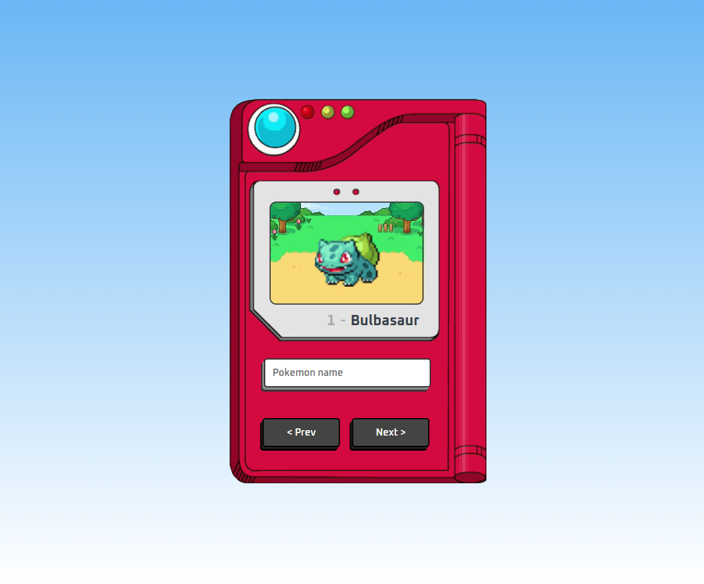

# ignite-todo

<a href="./LICENSE.md">
    
</a>

</br>



## 💻 About this project

Welcome to my Pokedex project! This is a side project I developed for fun, inspired by the popular Pokemon games and TV series. With this Pokedex, you can look up for a specific Pokemon or navigate through the list of Pokemon using the next and previous buttons.

I'll be happy if you could send me any feedback about the project, code, structure or anything that you can report that could make me better as a developer!

And you can use this project as you wish!

## :octocat: Cloning repo

```bash
    $ git clone https://github.com/bw3sley/pokedex.git
    
    $ cd pokedex 
```

## :octocat: Installing dependencies

```bash
    npm i
```

## :octocat: Running the project

```bash
    npm run dev
```

## 🚀 Built with

This project was built with:

- Vite
- ReactJS
- TypeScript
- CSS

## 📩 Reach me out

You can reach me at:

Reach me at: bw3sley@gmail.com

Connect with me at [LinkedIn](https://www.linkedin.com/in/bw3sley)

## 📝 License

This project is licensed under the MIT License - see the [LICENSE.md](./LICENSE.md) file for details.